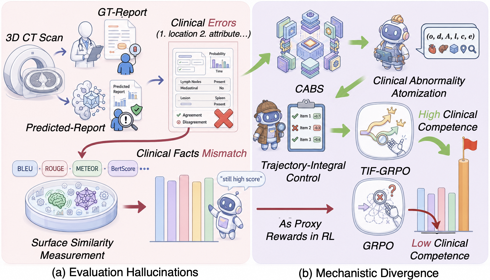
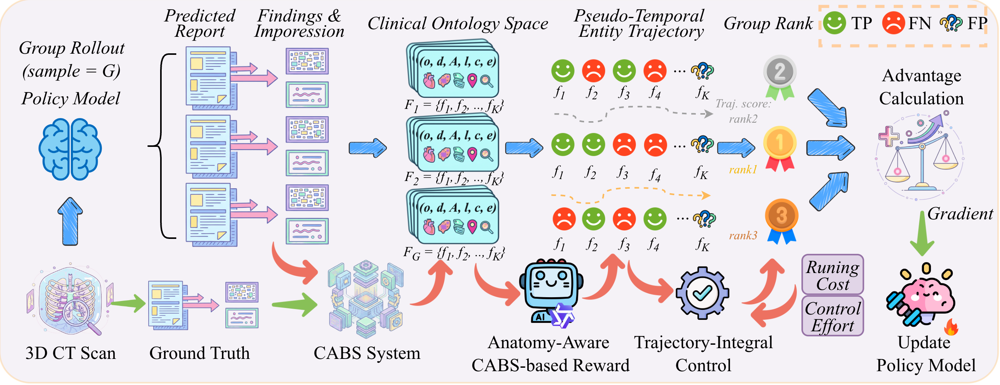

<div align="center">

# TIF-GRPO: Regulating Anatomy-Aware Rewards via Trajectory-Integral Feedback for Volumetric Computed Tomography Analysis

<p>
  Tianwei Lin<sup>1,2,*</sup>,
  Zhongwei Qiu<sup>2,3,1,*</sup>,
  Jie Cao<sup>1</sup>,
  Jiang Liu<sup>1</sup>,
  Wenjie Yan<sup>1</sup>,
  Bo Zhang<sup>4</sup>,
  Yu Zhong<sup>1</sup>,
  Wenqiao Zhang<sup>1,&#8224;</sup>,
  Yingda Xia<sup>2</sup>,
  Ling Zhang<sup>2,&#8224;</sup>
</p>

<p>
  <sup>1</sup>Zhejiang University &nbsp;|&nbsp;
  <sup>2</sup>DAMO Academy, Alibaba Group &nbsp;|&nbsp;
  <sup>3</sup>Hupan Lab &nbsp;|&nbsp;
  <sup>4</sup>University of Electronic Science and Technology of China
</p>

<p><sup>*</sup>Equal contribution &nbsp;&nbsp; <sup>&#8224;</sup>Corresponding authors</p>

<p>
<a href='https://arxiv.org/pdf/2605.20277'></a>
</p>

<!-- [](#overview)
[](#)
[](#repository-status) -->

<p>
TIF-GRPO is a clinically grounded reinforcement learning framework for 3D CT MRG task.
It replaces surface-level proxy rewards with structured abnormality feedback and trajectory-integral regulation,
improving factuality, abnormality detection, and robustness in volumetric radiology report generation.
</p>

</div>

## Overview

Medical vision-language models (VLMs) for CT analysis are typically trained with supervised fine-tuning (SFT) based on next-token prediction over reference reports. This objective mainly encourages fitting dominant reporting patterns and surface-level language distributions, rather than explicitly grounding findings in image evidence. As a result, models can generate fluent and stylistically consistent reports while still hallucinating findings, missing subtle abnormalities, or producing anatomically inconsistent descriptions.

Subsequent reinforcement learning (RL) optimization often relies on lexical overlap rewards such as BLEU, ROUGE, or related text-similarity proxies, which further amplifies the mismatch between linguistic similarity and clinical correctness. Consequently, a report may achieve high text-level scores while still containing clinically dangerous errors, including incorrect locations, wrong attributes, or omission of critical abnormalities.


This project is built around two ideas:

| Component | Role |
| --- | --- |
| **CABS** | A **Clinical Abnormality Benchmarking Substrate** that decomposes reports into structured abnormality units: organ, disease entity, attributes, anatomical location, certainty, and evidence. |
| **TIF-GRPO** | A **Trajectory-Integral Feedback** version of GRPO that regulates reward assignment along a pseudo-temporal abnormality trajectory, explicitly penalizing persistent omissions and suppressing hallucinated findings. |

Together, they turn report optimization from surface-text matching into **fine-grained clinical credit assignment**.

## Motivation

<div align="center">
  
</div>

Standard report-level metrics may assign high scores to outputs that are still clinically wrong.  
Our paper identifies two key failure modes:

1. **Evaluation Hallucination**: existing metrics overestimate clinical quality because they emphasize language similarity rather than verifiable medical facts.
2. **Mechanistic Divergence**: when these proxy metrics are used as RL rewards, optimization can actively drift away from real diagnostic correctness.

## Method

<div align="center">
  
</div>

TIF-GRPO introduces a clinically meaningful optimization loop:

1. A predicted report and the ground-truth report are both parsed by **CABS** into structured abnormality units.
2. These units define an **anatomy-aware reward space**, rather than a single undifferentiated text score.
3. A **trajectory-integral controller** accumulates false-negative signals across the abnormality trajectory while penalizing false positives as unnecessary control effort.
4. The resulting reward is injected into GRPO to produce more stable and more clinically faithful policy updates.

In short, TIF-GRPO encourages the model to be correct for the right reason:  
**detect the right abnormality, at the right anatomical location, with the right clinical attributes.**

## Repository Layout

```
TIF-GRPO/
├── reward/
│   ├── medical_report_abnormality.py   # the anatomy-aware TIF reward (drop into verl)
│   └── example.json                    # one scorable data record (schema reference)
└── README.md
```

The pipeline has two stages: a **supervised fine-tuning (SFT)** cold start,
followed by **reinforcement learning (RL)** with the TIF reward. The two stages
reuse mature open-source frameworks — we only provide the pieces that are
specific to our method (the reward and the data schema).

## Supervised Fine-Tuning (SFT)

The SFT cold start is a standard next-token objective over reference reports and
requires nothing custom from this repo. We run it with
[LLaMA-Factory](https://github.com/hiyouga/LLaMA-Factory), and we gratefully
acknowledge that project — please follow its documentation for data registration,
configuration, and launching. The SFT target is simply the report string
`"<findings> ... </findings>\n<impression> ... </impression>"`.

## Reinforcement Learning (RL)

RL uses [verl](https://github.com/volcengine/verl) with GRPO. We do not vendor
verl (it evolves quickly) — instead, drop our reward into your own checkout.
Follow verl's own documentation for installation and for launching the GRPO
trainer; the method-specific steps are:

1. **Add the reward** to verl's reward package:

   ```bash
   cp reward/medical_report_abnormality.py verl/verl/utils/reward_score/
   ```

2. **Register the data source** in `verl/verl/utils/reward_score/__init__.py`,
   inside `default_compute_score`:

   ```python
   elif data_source == "medical-report-abnormality":
       from . import medical_report_abnormality
       res = medical_report_abnormality.compute_score(
           solution_str, ground_truth, extra_info=extra_info
       )
   ```

   (Or skip this edit entirely via verl's
   `custom_reward_function.path=.../medical_report_abnormality.py` +
   `custom_reward_function.name=compute_score`.)

3. **Serve an OpenAI-compatible judge** and point the reward at it via env vars:

   ```bash
   export TIF_JUDGE_BASE_URL="http://127.0.0.1:8000/v1"
   export TIF_JUDGE_MODEL="<served-model-name>"
   export TIF_JUDGE_API_KEY="EMPTY"   # any non-empty string for local vLLM
   # optional: TIF_JUDGE_TIMEOUT / TIF_JUDGE_MAX_RETRIES / TIF_JUDGE_TEMPERATURE
   ```

4. **Train** with verl's GRPO trainer (`algorithm.adv_estimator=grpo`) on a parquet
   whose rows use `data_source="medical-report-abnormality"` and carry the fields in
   [Data Schema](#data-schema). Reward hyper-parameters live in `RewardConfig` and
   default to the values reported in the paper.

## Reward

The reward turns report optimization into fine-grained clinical credit assignment,
in four steps (all in [`reward/medical_report_abnormality.py`](reward/medical_report_abnormality.py)):

1. **Format check** — the response must carry every required section tag
   (`<findings>...</findings>`, `<impression>...</impression>`), in order.
2. **LLM judge** — for each section, a judge aligns the free-text prediction to
   the section's structured ground-truth abnormalities and returns, per entity,
   whether it was hit and whether its location and attributes are consistent, plus
   a list of hallucinated false positives.
3. **Trajectory-Integral Feedback (TIF)** — this structured comparison is collapsed
   into a scalar reward. A missed abnormality is charged not once but along a
   pseudo-temporal trajectory, so persistent omissions are penalized more heavily
   than transient ones; hallucinated findings are penalized as control effort; and
   correctly detected abnormalities — matched in location and attributes — are
   rewarded. Reports with no ground-truth abnormalities are handled as a special
   case that rewards a clean prediction and penalizes any false positive.
4. **Combination** — the per-section TIF scores and the format reward are combined
   and multiplied by a soft length penalty that discourages runaway generations.

All coefficients are fields of `RewardConfig` and can be overridden without editing
the code; the defaults reproduce the values used in the paper. Run the offline
self-test (no LLM required):

```bash
python reward/medical_report_abnormality.py
```

## Data Schema

Each training/eval record follows verl's rule-based format; the reward reads the
structured ground truth from `extra_info`. A complete example is in
[`reward/example.json`](reward/example.json).

| Field | Description |
| --- | --- |
| `data_source` | Must be `"medical-report-abnormality"` to route to this reward. |
| `prompt` | Chat messages given to the policy model. |
| `images` / `videos` | Visual inputs (as required by your VLM). |
| `reward_model.ground_truth` | Reference report string `"<findings>...</findings>\n<impression>...</impression>"`. |
| `extra_info.info.<section>_abnormality_entity.abnormalities` | The structured ground truth the reward scores against, per section (`findings`, `impression`). |

Each abnormality entity carries:

| Field | Meaning |
| --- | --- |
| `name` | Standardized abnormality name only (no location/attributes). |
| `evidence` | Verbatim span from the reference report supporting it. |
| `location` | Anatomical location (`""` if unstated). |
| `attributes` | Imaging attributes: size, distribution, appearance, change (`""` if unstated). |
| `certainty` | `definite` or `possible`. |
| `organ` | Normalized anatomical category (e.g. `lung_parenchyma`, `pleura`, `cardiac`). |

These structured entities are produced from reference reports by an LLM-based
extractor (the **CABS** substrate) as an offline preprocessing step. Any extractor
that emits the fields above is compatible — the reward only consumes the
`abnormalities` lists, not the extraction method.

## Acknowledgements

This project builds on excellent open-source work. We run supervised fine-tuning
with [LLaMA-Factory](https://github.com/hiyouga/LLaMA-Factory) and reinforcement
learning with [verl](https://github.com/volcengine/verl). We thank their authors
and communities.

## Citation

If our work is helpful to you, we would appreciate a citation:

```bibtex
@article{lin2026regulating,
  title={Regulating Anatomy-Aware Rewards via Trajectory-Integral Feedback for Volumetric Computed Tomography Analysis},
  author={Lin, Tianwei and Qiu, Zhongwei and Cao, Jie and Liu, Jiang and Yan, Wenjie and Zhang, Bo and Zhong, Yu and Zhang, Wenqiao and Xia, Yingda and Zhang, Ling},
  journal={arXiv preprint arXiv:2605.20277},
  year={2026}
}
```
